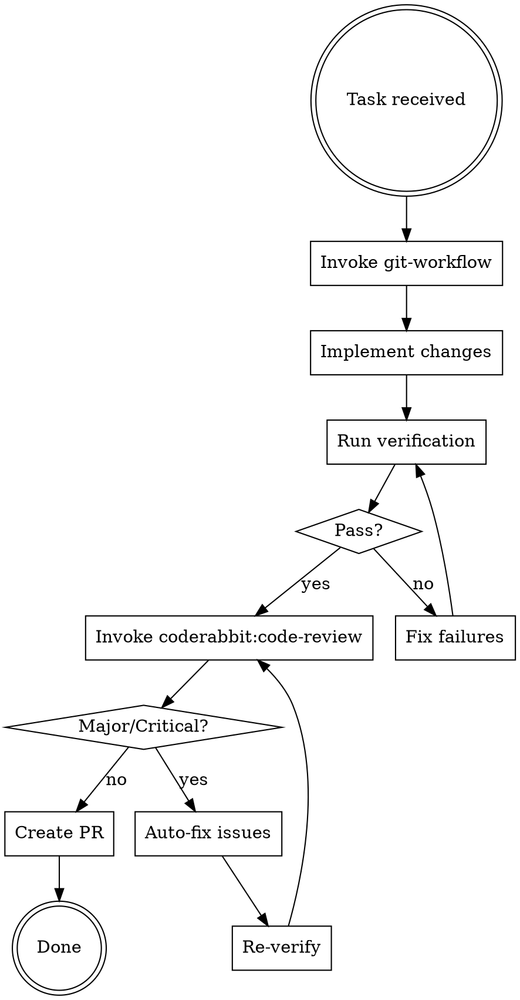

# Code Implementation Workflow

## Core Rule

**Issue → Branch → Implement → Verify → Review → Auto-fix → PR. No exceptions.**

Never code without a branch. Never merge without a review. Never ship without passing tests.

## The Process



## Step-by-Step

### 1. Create Issue & Branch
Invoke `git-workflow` skill. This creates the GitHub issue and branch before any code changes.

### 2. Implement Changes
Make code changes following the Gantry implementation guidance below.

### 3. Verify Before Review
Run all verification checks **before** invoking code review:

```bash
# Tests must pass
uv run pytest tests/ -v

# Linting must pass
uv run ruff check src/

# Auto-format code
uv run ruff format src/
```

**STOP if tests fail.** Fix them and re-verify. Do not proceed to code review.

### 4. Code Review
Invoke `coderabbit:code-review` skill. This runs a professional AI code review.

### 5. Auto-fix Major/Critical Issues Only
Review returned issues. Fix **only major and critical issues** automatically — ignore nitpicks, style suggestions, and minor comments entirely.

After fixing:
```bash
uv run pytest tests/ -v
uv run ruff check src/
uv run ruff format src/
```

Then re-invoke `coderabbit:code-review` to verify fixes.

### 6. Create PR
Invoke `git-workflow` skill to create the PR linking the issue.

## Gantry Implementation Guidance

### Where to Make Changes

| Change Type | File(s) |
|---|---|
| UI / screen logic | `src/gantry/screens.py` |
| K8s resource types | `src/gantry/k8s.py` + update `ClusterScreen.RESOURCE_COLUMNS` in screens.py |
| New keybindings | `BINDINGS` list + `action_*()` method in screens.py |
| Helm operations | `src/gantry/helm.py` |
| State persistence | `src/gantry/state.py` |
| Tests | `tests/test_<module>.py` mirroring source files |

### Verification Checklist

Before submitting for review, verify:

- [ ] `uv run pytest tests/ -v` passes (68+ tests)
- [ ] `uv run ruff check src/` passes
- [ ] `uv run ruff format src/` applied
- [ ] No new bare `except:` or broad `Exception` catches
- [ ] New keybindings added to `BINDINGS` with tests in `test_app.py`
- [ ] No async race conditions (check resource loading order)

## Red Flags — STOP

| Thought | Reality | Fix |
|---|---|---|
| "Tests pass, I'm done" | Not done until code review is clean | Run `coderabbit:code-review` |
| "Skip review for this one" | Review always, no exceptions | Never skip |
| "I'll fix review issues later" | Fix now, not after PR | Auto-fix immediately |
| "Small change, skip git-workflow" | Always create issue + branch | Takes 30 seconds |
| "Tests are slow, skip them" | Tests catch regressions | Always run full suite |

## Integration

**Called by:** Any implementation task (feature, bugfix, refactor)

**Calls in sequence:**
1. `git-workflow` (creates issue + branch)
2. `coderabbit:code-review` (review after verify)

**Pairs with:** `git-workflow`, `coderabbit:code-review`, `superpowers:verification-before-completion`

## Common Mistakes

### "My changes pass tests locally"
Tests passing ≠ code review passing. Code review checks for logic errors, security issues, and architectural problems that linters miss.

**Fix:** Always run `coderabbit:code-review` before PR, even if tests pass.

### "Review found nitpicks, I'll ignore them"
Ignore minor/style issues, but **do not ignore major/critical findings**. They indicate real bugs or security issues.

**Fix:** Auto-fix major/critical, ignore nitpicks, then re-review.

### "I implemented but didn't verify"
If verification fails, the review is useless — it's reviewing broken code.

**Fix:** Always verify (tests + linting) BEFORE review.
