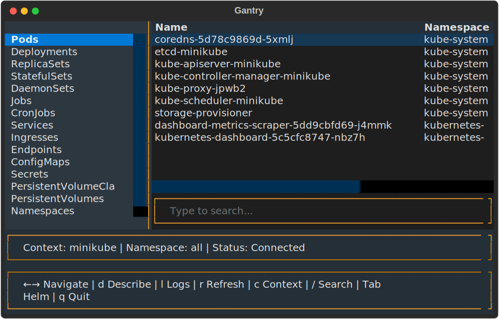

# gantry

Keyboard-first TUI for Kubernetes cluster management and Helm orchestration.



## Features

- Browse 16 K8s resource types: Pods, Deployments, ReplicaSets, StatefulSets, DaemonSets, Jobs, CronJobs, Services, Ingresses, Endpoints, ConfigMaps, Secrets, PVCs, PVs, Namespaces, Nodes
- Left sidebar for fast resource type switching
- Describe resources + view pod logs in a right-side detail panel
- Vim-style `/` search and filter
- Manage Helm repositories and deploy charts
- Context and namespace switching via modal picker
- State persistence across sessions

## Requirements

- Python 3.11+
- `kubectl` + valid kubeconfig
- `helm` CLI (optional — graceful degradation if missing)

## Install

```bash
uv sync
```

## Run

```bash
uv run python -m gantry

# With debug logging
uv run python -m gantry --debug
```

## Keybindings

| Key | Action |
|-----|--------|
| `Tab` | Switch Cluster / Helm view |
| `←` / `→` | Navigate panels |
| `c` | Context + namespace picker |
| `/` | Search / filter |
| `d` | Describe selected resource |
| `y` | View YAML manifest |
| `m` | Toggle YAML mode (full / spec-only) |
| `l` | View pod logs |
| `r` | Refresh |
| `Enter` | Deploy Helm chart |
| `Escape` | Close panel / cancel search |
| `q` | Quit |

## Update Screenshot

```bash
bash scripts/screenshot.sh
```

## License

MIT
